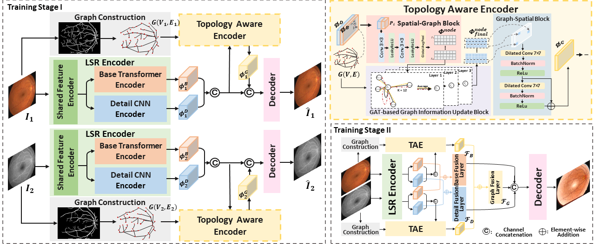
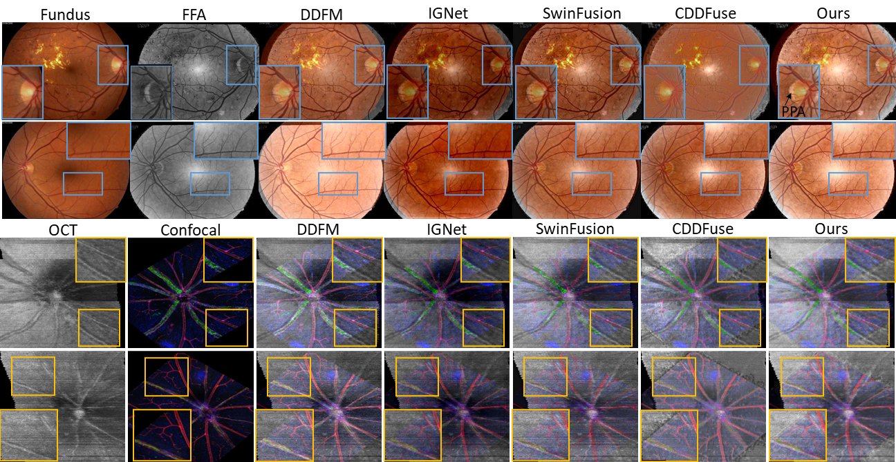

# TaGAT: Topology-Aware Graph Attention Network For Multi-modal Retinal Image Fusion

This repository contains the source code and models for the paper "TaGAT: Topology-Aware Graph Attention Network For Multi-modal Retinal Image Fusion," **accepted at MICCAI 2024**

The method introduces a novel Topology-Aware Graph Attention Network (TaGAT) designed for fusing multi-modal retinal images.

## Abstract

In the realm of medical image fusion, integrating information from various modalities is crucial for improving diagnostics and treatment planning, especially in retinal health. Existing deep learning-based approaches insufficiently focus on retinal image fusion, often failing to preserve anatomical structures and fine vessel details. To address this, we propose the Topology-Aware Graph Attention Network (TaGAT) for multi-modal retinal image fusion, leveraging a novel Topology-Aware Encoder (TAE) with Graph Attention Networks (GAT) to enhance spatial features with the retinal vasculature's graph topology across modalities. Our model outperforms state-of-the-art methods in fusing Fluorescein Fundus Angiography (FFA) with Color Fundus (CF) and Optical Coherence Tomography (OCT) with confocal microscopy retinal images.

## Methodology

### Overview

The proposed framework for multi-modal retinal image fusion is illustrated below. The input images are first registered, followed by feature extraction and fusion using the Long-short Range (LSR) encoder and the Topology-Aware Encoder (TAE). The Graph Attention Network (GAT) dynamically refines and aggregates the node features to generate topology-aware graph features, which are then combined and decoded into the fused image.



### Graph Construction

The graph is constructed based on the segmentation of blood vessels from the retinal images. The nodes represent vascular branching points and endpoints, interconnected through edges based on the vessel network's connectivity.

### Long-short Range Encoder

The LSR Encoder, adapted from [MMIF-CDDFuse](https://github.com/Zhaozixiang1228/MMIF-CDDFuse), is a dual-branch encoder extracting base and detail features across modalities. It consists of three main components:: Shared Feature Encoder (SFE), Base Transformer Encoder (BTE), Detail CNN Encoder (DCE)

### Topology Aware Encoder

The TAE integrates spatial and topological information from retinal images. It comprises three main blocks:
1. Spatial-to-Graph Block (S2G)
2. GAT-based Graph Information Update Block (GAT-GIU)
3. Graph-to-Spatial Block (G2S)

### Decoder

The decoder reduces the channel of concatenated features and reconstructs the fused image. A two-stage training strategy is employed to ensure optimal performance.

## Results

The following figure shows a visual comparison of the fusion results on DRFF and OCT2Confocal datasets.


<!--
## Getting Started

### Prerequisites

- Python 3.8+
- torch==1.8.1+cu111
- torchvision
- numpy
- matplotlib
- opencv-python 4.5.3.56
- einops==0.4.1
- kornia==0.2.0
- numpy==1.21.5
- opencv_python==4.5.3.56
- scikit_image==0.19.2
- scikit_learn==1.1.3
- scipy==1.7.3
- tensorboardX==2.5.1
- timm==0.4.12


### Installation

Clone this repository and install the required packages:

```bash
git clone https://github.com/xintian-99/TaGAT.git
cd TaGAT
pip install -r requirements.txt
-->

### Citation

@article{tian2024tagat,
  title={TaGAT: Topology-Aware Graph Attention Network For Multi-modal Retinal Image Fusion},
